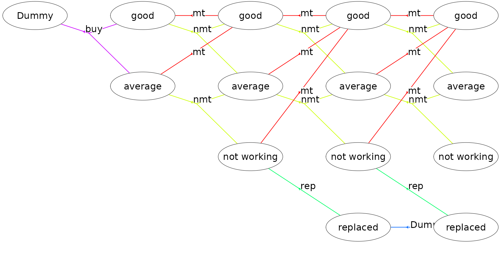
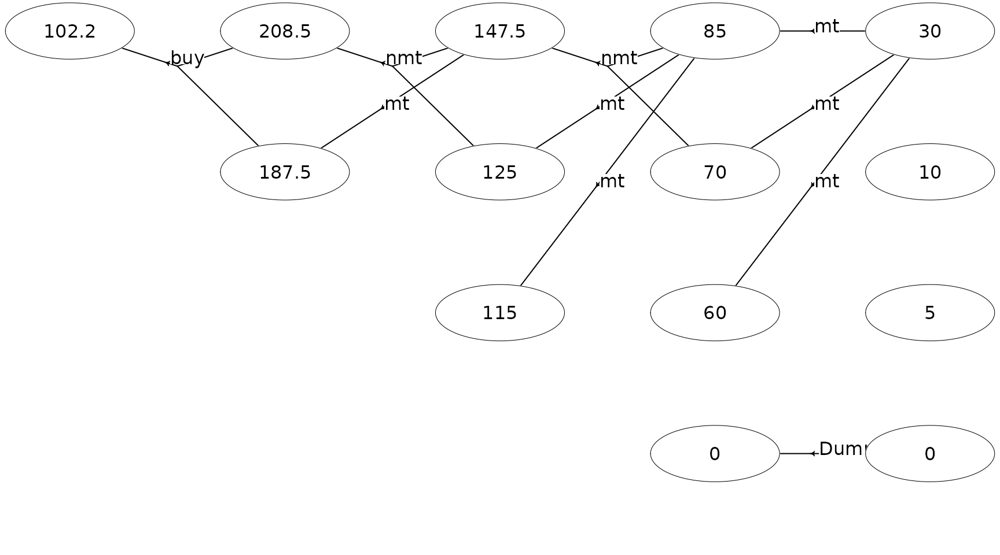

# Solving a finite-horizon semi-MDP

The `MDP2` package in R is a package for solving Markov decision
processes (MDPs) with discrete time-steps, states and actions. Both
traditional MDPs (Puterman 1994), semi-Markov decision processes
(semi-MDPs) (Tijms 2003) and hierarchical-MDPs (HMDPs) (Kristensen and
Jørgensen 2000) can be solved under a finite and infinite time-horizon.

The package implement well-known algorithms such as policy iteration and
value iteration under different criteria e.g. average reward per time
unit and expected total discounted reward. The model is stored using an
underlying data structure based on the *state-expanded directed
hypergraph* of the MDP (Nielsen and Kristensen (2006)) implemented in
`C++` for fast running times.

Building and solving an MDP is done in two steps. First, the MDP is
built and saved in a set of binary files. Next, you load the MDP into
memory from the binary files and apply various algorithms to the model.

For building the MDP models see
[`vignette("building")`](http://relund.github.io/mdp/articles/building.md).
In this vignette we focus on the second step, i.e. finding the optimal
policy. Here we consider a finite-horizon semi-MDP.

``` r

library(MDP2)
```

## A finite-horizon semi-MDP

A *finite-horizon semi-MDP* considers a sequential decision problem over
$`N`$*stages*. Let $`I_{n}`$ denote the finite set of system states at
stage $`n`$. When *state* $`i \in I_{n}`$ is observed, an *action* $`a`$
from the finite set of allowable actions $`A_n(i)`$ must be chosen, and
this decision generates *reward* $`r_{n}(i,a)`$. Moreover, let
$`\tau_n(i,a)`$ denote the *stage length* of action $`a`$, i.e. the
expected time until the next decision epoch (stage $`n+1`$) given action
$`a`$ and state $`i`$. Finally, let $`p_{ij}(a,n)`$ denote the
*transition probability* of obtaining state $`j\in I_{n+1}`$ at stage
$`n+1`$ given that action $`a`$ is chosen in state $`i`$ at stage $`n`$.

## Example

Consider a small machine repair problem used as an example in Nielsen
and Kristensen (2006) where the machine is always replaced after 4
years. The state of the machine may be: good, average, and not working.
Given the machine’s state we may maintain the machine. In this case the
machine’s state will be good at the next decision epoch. Otherwise, the
machine’s state will not be better at next decision epoch. When the
machine is bought it may be either in state good or average. Moreover,
if the machine is not working it must be replaced.

The problem of when to replace the machine can be modeled using a Markov
decision process with $`N=5`$ decision epochs. We use system states
`good`, `average`, `not working` and dummy state `replaced` together
with actions buy (`buy`), maintain (`mt`), no maintenance (`nmt`), and
replace (`rep`). The set of states at stage zero $`S_{0}`$ contains a
single dummy state `dummy` representing the machine before knowing its
initial state. The only possible action is `buy`.

The cost of buying the machine is 100 with transition probability of 0.7
to state `good` and 0.3 to state `average`. The reward (scrap value) of
replacing a machine is 30, 10, and 5 in state `good`, `average` and
`not working`, respectively. The reward of the machine given action `mt`
are 55, 40, and 30 in state `good`, `average` and `not working`,
respectively. Moreover, the system enters state 0 with probability 1 at
the next stage. Finally, the reward, transition states and probabilities
given action $`a=`$`nmt` are given by:

| $`n:s`$ | $`1:`$`good` | $`1:`$`average` | $`2:`$`good` | $`2:`$`average` | $`3:`$`good` | $`3:`$`average` |
|:---|:--:|:--:|:--:|:--:|:--:|:--:|
| $`r_n(i,a)`$ | 70 | 50 | 70 | 50 | 70 | 50 |
| $`j`$ | $`\{0,1\}`$ | $`\{1,2\}`$ | $`\{0,1\}`$ | $`\{1,2\}`$ | $`\{0,1\}`$ | $`\{1,2\}`$ |
| $`p_{ij}(a,n)`$ | $`\{0.6,0.4\}`$ | $`\{0.6,0.4\}`$ | $`\{0.5,0.5\}`$ | $`\{0.5,0.5\}`$ | $`\{0.2,0.8\}`$ | $`\{0.2,0.8\}`$ |

Let us try to load the model and get some info:

``` r

prefix <- paste0(system.file("models", package = "MDP2"), "/machine1_")
mdp <- loadMDP(prefix)
```

    #> Read binary files (0.000143877 sec.)
    #> Build the HMDP (3.608e-05 sec.)

    #> Checking MDP and found no errors (2.466e-06 sec.)

``` r

getInfo(mdp, withList = F, dfLevel = "action", asStringsActions = TRUE)  
```

    #> $df
    #> # A tibble: 18 × 8
    #>      sId stateStr label        aIdx label_action weights trans pr     
    #>    <dbl> <chr>    <chr>       <dbl> <chr>        <chr>   <chr> <chr>  
    #>  1     4 3,0      good            0 mt           55      0     1      
    #>  2     4 3,0      good            1 nmt          70      0,1   0.2,0.8
    #>  3     5 3,1      average         0 mt           40      0     1      
    #>  4     5 3,1      average         1 nmt          50      1,2   0.2,0.8
    #>  5     6 3,2      not working     0 mt           30      0     1      
    #>  6     6 3,2      not working     1 rep          5       3     1      
    #>  7     7 3,3      replaced        0 Dummy        0       3     1      
    #>  8     8 2,0      good            0 mt           55      4     1      
    #>  9     8 2,0      good            1 nmt          70      4,5   0.5,0.5
    #> 10     9 2,1      average         0 mt           40      4     1      
    #> 11     9 2,1      average         1 nmt          50      5,6   0.5,0.5
    #> 12    10 2,2      not working     0 mt           30      4     1      
    #> 13    10 2,2      not working     1 rep          5       7     1      
    #> 14    11 1,0      good            0 mt           55      8     1      
    #> 15    11 1,0      good            1 nmt          70      8,9   0.6,0.4
    #> 16    12 1,1      average         0 mt           40      8     1      
    #> 17    12 1,1      average         1 nmt          50      9,10  0.6,0.4
    #> 18    13 0,0      Dummy           0 buy          -100    11,12 0.7,0.3

The state-expanded hypergraph representing the semi-MDP with finite
time-horizon can be plotted using

``` r

plot(mdp, hyperarcColor = "label", radx = 0.06, marX = 0.065, marY = 0.055)
```



Each node corresponds to a specific state and a directed hyperarc is
defined for each possible action. For instance, action `mt` (maintain)
corresponds to a deterministic transition to state `good` and action
`nmt` (not maintain) corresponds to a transition to a condition/state
not better than the current condition/state. We buy the machine in stage
1 and may choose to replace the machine.

Let us use value iteration to find the optimal policy maximizing the
expected total reward:

``` r

scrapValues <- c(30, 10, 5, 0)   # scrap values (the values of the 4 states at the last stage)
runValueIte(mdp, "Net reward", termValues = scrapValues)
```

    #> Run value iteration with epsilon = 0 at most 1 time(s)
    #> using quantity 'Net reward' under reward criterion.
    #>  Finished. Cpu time 7.542e-06 sec.

The optimal policy is:

``` r

pol <- getPolicy(mdp)
tail(pol)
```

    #> # A tibble: 6 × 6
    #>     sId stateStr stateLabel   aIdx actionLabel weight
    #>   <dbl> <chr>    <chr>       <int> <chr>        <dbl>
    #> 1     8 2,0      good            1 nmt           148.
    #> 2     9 2,1      average         0 mt            125 
    #> 3    10 2,2      not working     0 mt            115 
    #> 4    11 1,0      good            1 nmt           208.
    #> 5    12 1,1      average         0 mt            188.
    #> 6    13 0,0      Dummy           0 buy           102.

``` r

plot(mdp, hyperarcShow = "policy", nodeLabel = "weight", 
     radx = 0.06, marX = 0.065, marY = 0.055)
```



Note given the optimal policy the total expected reward is 102.2 and the
machine will never make a transition to states `not working` and
`replaced`.

We may evaluate a certain policy, e.g. the policy always to maintain the
machine:

``` r

policy<-data.frame(sId=c(8,11), aIdx=c(0,0)) # set the policy for sId 8 and 11 to mt
setPolicy(mdp, policy)
getPolicy(mdp)
```

    #> # A tibble: 14 × 6
    #>      sId stateStr stateLabel   aIdx actionLabel weight
    #>    <dbl> <chr>    <chr>       <int> <chr>        <dbl>
    #>  1     0 4,0      good           -1 ""             30 
    #>  2     1 4,1      average        -1 ""             10 
    #>  3     2 4,2      not working    -1 ""              5 
    #>  4     3 4,3      replaced       -1 ""              0 
    #>  5     4 3,0      good            0 "mt"           85 
    #>  6     5 3,1      average         0 "mt"           70 
    #>  7     6 3,2      not working     0 "mt"           60 
    #>  8     7 3,3      replaced        0 "Dummy"         0 
    #>  9     8 2,0      good            0 "mt"          148.
    #> 10     9 2,1      average         0 "mt"          125 
    #> 11    10 2,2      not working     0 "mt"          115 
    #> 12    11 1,0      good            0 "mt"          208.
    #> 13    12 1,1      average         0 "mt"          188.
    #> 14    13 0,0      Dummy           0 "buy"         102.

If the policy specified in `setPolicy` does not contain all states then
the actions from the previous optimal policy are used. In the output
above we can see that the policy now is to maintain always. However, the
reward of the policy has not been updated. Let us calculate the expected
reward:

``` r

runCalcWeights(mdp, "Net reward", termValues = scrapValues)
tail(getPolicy(mdp))    
```

    #> # A tibble: 6 × 6
    #>     sId stateStr stateLabel   aIdx actionLabel weight
    #>   <dbl> <chr>    <chr>       <int> <chr>        <dbl>
    #> 1     8 2,0      good            0 mt           140  
    #> 2     9 2,1      average         0 mt           125  
    #> 3    10 2,2      not working     0 mt           115  
    #> 4    11 1,0      good            0 mt           195  
    #> 5    12 1,1      average         0 mt           180  
    #> 6    13 0,0      Dummy           0 buy           90.5

That is, the expected reward is 90.5 compared to 102.2 which was the
reward of the optimal policy.

## References

Kristensen, A. R., and E. Jørgensen. 2000. “Multi-Level Hierarchic
Markov Processes as a Framework for Herd Management Support.” *Annals of
Operations Research* 94: 69–89.
<https://doi.org/10.1023/A:1018921201113>.

Nielsen, L. R., and A. R. Kristensen. 2006. “Finding the $`K`$ Best
Policies in a Finite-Horizon Markov Decision Process.” *European Journal
of Operational Research* 175 (2): 1164–79.
<https://doi.org/10.1016/j.ejor.2005.06.011>.

Puterman, M. L. 1994. *Markov Decision Processes*. Wiley Series in
Probability and Mathematical Statistics. Wiley-Interscience.

Tijms, Henk. C. 2003. *A First Course in Stochastic Models*. John Wiley
& Sons Ltd.
