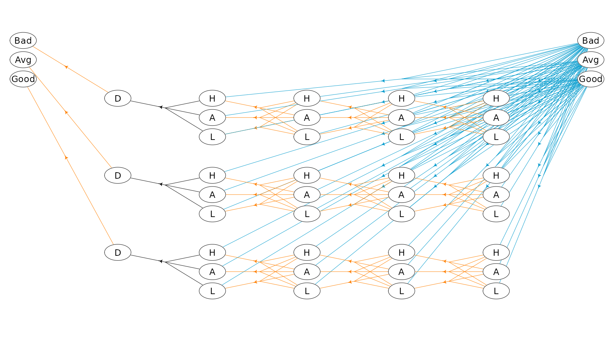
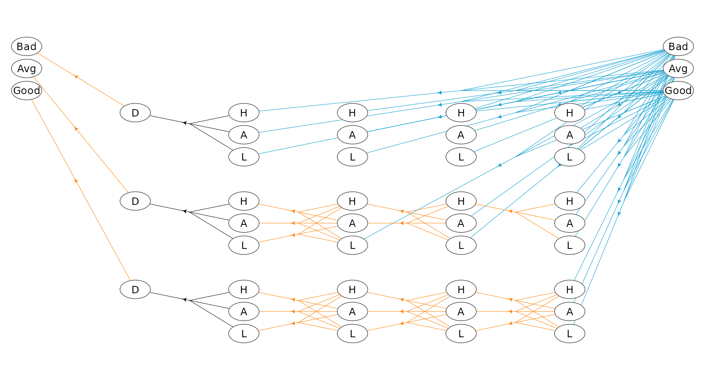

# An infinite-horizon HMDP

The `MDP2` package in R is a package for solving Markov decision
processes (MDPs) with discrete time-steps, states and actions. Both
traditional MDPs (Puterman 1994), semi-Markov decision processes
(semi-MDPs) (Tijms 2003) and hierarchical-MDPs (HMDPs) (Kristensen and
Jørgensen 2000) can be solved under a finite and infinite time-horizon.

The package implement well-known algorithms such as policy iteration and
value iteration under different criteria e.g. average reward per time
unit and expected total discounted reward. The model is stored using an
underlying data structure based on the *state-expanded directed
hypergraph* of the MDP (Nielsen and Kristensen (2006)) implemented in
`C++` for fast running times.

Building and solving an MDP is done in two steps. First, the MDP is
built and saved in a set of binary files. Next, you load the MDP into
memory from the binary files and apply various algorithms to the model.

For building the MDP models see
[`vignette("building")`](http://relund.github.io/mdp/articles/building.md).
In this vignette we focus on the second step, i.e. finding the optimal
policy. Here we consider an infinite-horizon HMDP.

``` r

library(MDP2)
```

## An infinite-horizon HMDP

A hierarchical MDP is an MDP with parameters defined in a special way,
but nevertheless in accordance with all usual rules and conditions
relating to such processes (Kristensen and Jørgensen (2000)). The basic
idea of the hierarchical structure is that stages of the process can be
expanded to a so-called *child process*, which again may expand stages
further to new child processes leading to multiple levels. To illustrate
consider the HMDP shown in the figure below. The process has three
levels. At `Level 2` we have a set of finite-horizon semi-MDPs (one for
each oval box) which all can be represented using a state-expanded
hypergraph (hyperarcs not shown, only hyperarcs connecting processes are
shown). A semi-MDP at `Level 2` is uniquely defined by a given state
$`s`$ and action $`a`$ of its *parent process* at `Level 1` (illustrated
by the arcs with head and tail node at `Level 1` and `Level 2`,
respectively). Moreover, when a child process at `Level 2` terminates a
transition from a state $`s\in \mathcal{S}_{N}`$ of the child process to
a state at the next stage of the parent process occur (illustrated by
the (hyper)arcs having head and tail at `Level 2` and `Level 1`,
respectively).


The state-expanded hypergraph of the first stage of a hierarchical MDP.
Level 0 indicate the founder level, and the nodes indicates states at
the different levels. A child process (oval box) is represented using
its state-expanded hypergraph (hyperarcs not shown) and is uniquely
defined by a given state and action of its parent process.

Since a child process is always defined by a stage, state and action of
the parent process we have that for instance a state at Level 1 can be
identified using an index vector $`\nu=(n_{0},s_{0},a_{0},n_{1},s_{1})`$
where $`s_1`$ is the state id at the given stage $`n_1`$ in the process
defined by the action $`a_0`$ in state $`s_0`$ at stage $`n_0`$. Note
all values are ids starting from zero, e.g. if $`s_1=0`$ it is the first
state at the corresponding stage and if $`a_0=2`$ it is the third action
at the corresponding state. In general a state $`s`$ and action $`a`$ at
level $`l`$ can be uniquely identified using
``` math
\begin{aligned}
\nu_{s}&=(n_{0},s_{0},a_{0},n_{1},s_{1},\ldots,n_{l},s_{l}) \\
\nu_{a}&=(n_{0},s_{0},a_{0},n_{1},s_{1},\ldots,n_{l},s_{l},a_{l}).
\end{aligned}
```
The index vectors for state $`v_0`$, $`v_1`$ and $`v_2`$ are illustrated
in the figure. As under a semi-MDP another way to identify a state in
the state-expanded hypergraph is using an unique id.

## Example

Let us try to solve a small problem from livestock farming, namely the
cow replacement problem where we want to represent the age of the cow,
i.e. the lactation number of the cow. During a lactation a cow may have
a high, average or low yield. We assume that a cow is always replaced
after 4 lactations.

In addition to lactation and milk yield we also want to take the genetic
merit into account which is either bad, average or good. When a cow is
replaced we assume that the probability of a bad, average or good heifer
is equal.

We formulate the problem as a HMDP with 2 levels. At level 0 the states
are the genetic merit and the length of a stage is a life of a cow. At
level 1 a stage describe a lactation and states describe the yield.
Decisions at level 1 are `keep` or `replace`.

Note the MDP runs over an infinite time-horizon at the founder level
where each state (genetic merit) define a semi-MDP at level 1 with 4
lactations.

Let us try to load the model and get some info:

``` r

prefix <- paste0(system.file("models", package = "MDP2"), "/cow_")
mdp <- loadMDP(prefix)
```

    #> Read binary files (0.000197937 sec.)
    #> Build the HMDP (0.000114823 sec.)

    #> Checking MDP and found no errors (1.473e-06 sec.)

``` r

mdp 
```

    #> $binNames
    #> [1] "/home/runner/work/_temp/Library/MDP2/models/cow_stateIdx.bin"         
    #> [2] "/home/runner/work/_temp/Library/MDP2/models/cow_stateIdxLbl.bin"      
    #> [3] "/home/runner/work/_temp/Library/MDP2/models/cow_actionIdx.bin"        
    #> [4] "/home/runner/work/_temp/Library/MDP2/models/cow_actionIdxLbl.bin"     
    #> [5] "/home/runner/work/_temp/Library/MDP2/models/cow_actionWeight.bin"     
    #> [6] "/home/runner/work/_temp/Library/MDP2/models/cow_actionWeightLbl.bin"  
    #> [7] "/home/runner/work/_temp/Library/MDP2/models/cow_transProb.bin"        
    #> [8] "/home/runner/work/_temp/Library/MDP2/models/cow_externalProcesses.bin"
    #> 
    #> $timeHorizon
    #> [1] Inf
    #> 
    #> $states
    #> [1] 42
    #> 
    #> $founderStatesLast
    #> [1] 3
    #> 
    #> $actions
    #> [1] 69
    #> 
    #> $levels
    #> [1] 2
    #> 
    #> $weightNames
    #> [1] "Duration"   "Net reward" "Yield"     
    #> 
    #> $ptr
    #> C++ object <0x563f8a5b1560> of class 'HMDP' <0x563f8cc98630>
    #> 
    #> attr(,"class")
    #> [1] "HMDP" "list"

The state-expanded hypergraph representing the HMDP with infinite
time-horizon can be plotted using

``` r

hgf <- getHypergraph(mdp)
## Rename labels
dat <- hgf$nodes %>% 
   dplyr::mutate(label = dplyr::case_when(
      label == "Low yield" ~ "L",
      label == "Avg yield" ~ "A",
      label == "High yield" ~ "H",
      label == "Dummy" ~ "D",
      label == "Bad genetic level" ~ "Bad",
      label == "Avg genetic level" ~ "Avg",
      label == "Good genetic level" ~ "Good",
      TRUE ~ "Error"
   ))
## Set grid id
dat$gId[1:3]<-85:87
dat$gId[43:45]<-1:3
getGId<-function(process,stage,state) {
   if (process==0) start=18
   if (process==1) start=22
   if (process==2) start=26
   return(start + 14 * stage + state)
}
idx<-43
for (process in 0:2)
   for (stage in 0:4)
      for (state in 0:2) {
         if (stage==0 & state>0) break
         idx<-idx-1
         #cat(idx,process,stage,state,getGId(process,stage,state),"\n")
         dat$gId[idx]<-getGId(process,stage,state)
      }
hgf$nodes <- dat
## Rename labels
dat <- hgf$hyperarcs %>% 
   dplyr::mutate(label = dplyr::case_when(
      label == "Replace" ~ "R",
      label == "Keep" ~ "K",
      label == "Dummy" ~ "D",
      TRUE ~ "Error"
      ),
      col = dplyr::case_when(
         label == "R" ~ "deepskyblue3",
         label == "K" ~ "darkorange1",
         label == "D" ~ "black",
         TRUE ~ "Error"
      ),
      lwd = 0.5,
      label = ""
   ) 
hgf$hyperarcs <- dat
## Make the plot
plotHypergraph(hgf, gridDim = c(14, 7), cex = 0.8, radx = 0.02, rady = 0.03)
```



Note action `keep` is drawn with orange color and action `replace` with
blue color.

We find the optimal policy under the expected discounted reward
criterion using policy iteration with an interest rate of 10%:

``` r

wLbl<-"Net reward"         # the weight we want to optimize (net reward)
durLbl<-"Duration"         # the duration/time label
runPolicyIteDiscount(mdp, wLbl, durLbl, rate = 0.1)
```

    #> Run policy iteration using quantity 'Net reward' under discounting criterion 
    #> with 'Duration' as duration using discount factor 0.904837. 
    #> Iteration(s): 1 2 3 4 finished. Cpu time: 1.473e-06 sec.

The optimal policy is:

``` r

hgf$hyperarcs <- right_join(hgf$hyperarcs, getPolicy(mdp), by = c("sId", "aIdx"))
plotHypergraph(hgf, gridDim = c(14, 7), cex = 0.8, radx = 0.02, rady = 0.03)
```



We may also find the policy which maximize the average reward per
lactation:

``` r

wLbl<-"Net reward"         # the weight we want to optimize (net reward)
durLbl<-"Duration"         # the duration/time label
runPolicyIteAve(mdp, wLbl, durLbl)
```

    #> Run policy iteration under average reward criterion using 
    #> reward 'Net reward' over 'Duration'. Iterations (g): 
    #> 1 (11000) 2 (11517.5) 3 (11543.8) 4 (11543.8) finished. Cpu time: 1.473e-06 sec.

    #> [1] 11543.83

``` r

getPolicy(mdp)
```

    #> # A tibble: 42 × 6
    #>      sId stateStr  stateLabel  aIdx actionLabel  weight
    #>    <dbl> <chr>     <chr>      <int> <chr>         <dbl>
    #>  1     3 0,2,0,4,0 Low yield      0 Replace     -7369. 
    #>  2     4 0,2,0,4,1 Avg yield      0 Replace     -5369. 
    #>  3     5 0,2,0,4,2 High yield     0 Replace     -3369. 
    #>  4     6 0,2,0,3,0 Low yield      0 Keep        -5912. 
    #>  5     7 0,2,0,3,1 Avg yield      0 Keep        -2912. 
    #>  6     8 0,2,0,3,2 High yield     0 Keep           87.7
    #>  7     9 0,2,0,2,0 Low yield      0 Keep        -3956. 
    #>  8    10 0,2,0,2,1 Avg yield      0 Keep         -456. 
    #>  9    11 0,2,0,2,2 High yield     0 Keep         3044. 
    #> 10    12 0,2,0,1,0 Low yield      0 Keep        -3750  
    #> # ℹ 32 more rows

Since other weights are defined for each action we can calculate the
average reward per litre milk under the optimal policy:

``` r

runCalcWeights(mdp, w=wLbl, criterion="average", dur = "Yield")
```

    #> [1] 1.932615

or the average yield per lactation:

``` r

runCalcWeights(mdp, w="Yield", criterion="average", dur = durLbl)
```

    #> [1] 5973.166

## References

Kristensen, A. R., and E. Jørgensen. 2000. “Multi-Level Hierarchic
Markov Processes as a Framework for Herd Management Support.” *Annals of
Operations Research* 94: 69–89.
<https://doi.org/10.1023/A:1018921201113>.

Nielsen, L. R., and A. R. Kristensen. 2006. “Finding the $`K`$ Best
Policies in a Finite-Horizon Markov Decision Process.” *European Journal
of Operational Research* 175 (2): 1164–79.
<https://doi.org/10.1016/j.ejor.2005.06.011>.

Puterman, M. L. 1994. *Markov Decision Processes*. Wiley Series in
Probability and Mathematical Statistics. Wiley-Interscience.

Tijms, Henk. C. 2003. *A First Course in Stochastic Models*. John Wiley
& Sons Ltd.
