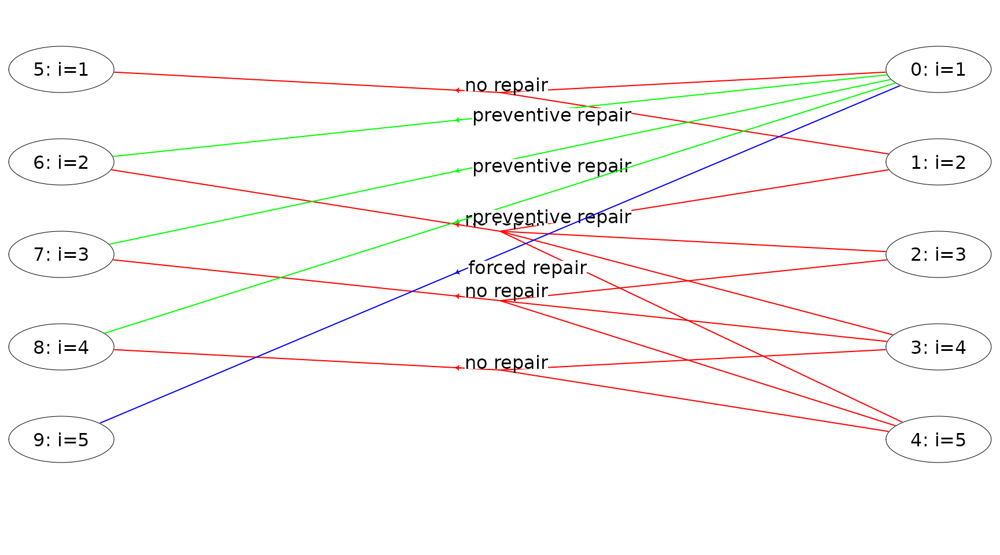
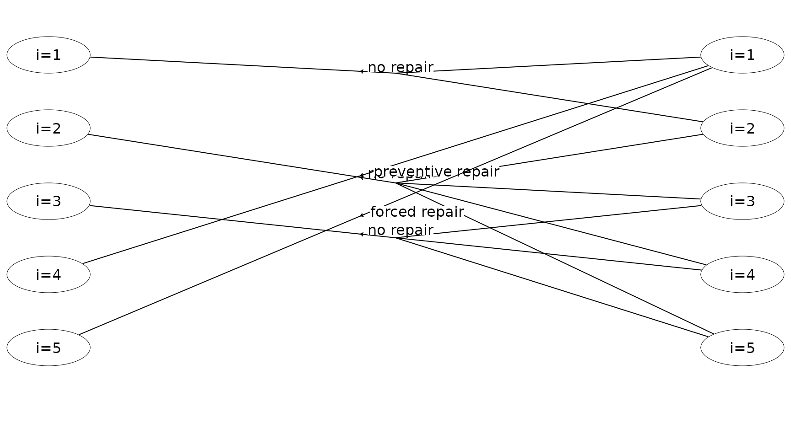
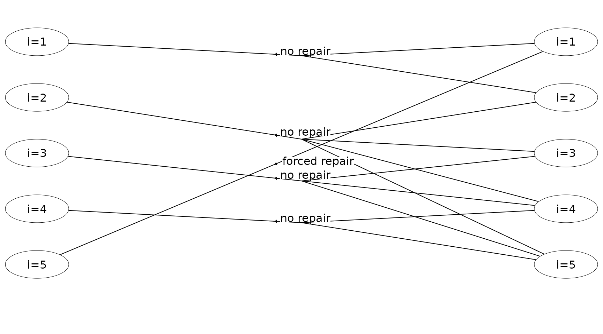

# Solving an infinite-horizon semi-MDP

The `MDP2` package in R is a package for solving Markov decision
processes (MDPs) with discrete time-steps, states and actions. Both
traditional MDPs (Puterman 1994), semi-Markov decision processes
(semi-MDPs) (Tijms 2003) and hierarchical-MDPs (HMDPs) (Kristensen and
Jørgensen 2000) can be solved under a finite and infinite time-horizon.

The package implement well-known algorithms such as policy iteration and
value iteration under different criteria e.g. average reward per time
unit and expected total discounted reward. The model is stored using an
underlying data structure based on the *state-expanded directed
hypergraph* of the MDP (Nielsen and Kristensen (2006)) implemented in
`C++` for fast running times.

Building and solving an MDP is done in two steps. First, the MDP is
built and saved in a set of binary files. Next, you load the MDP into
memory from the binary files and apply various algorithms to the model.

For building the MDP models see
[`vignette("building")`](http://relund.github.io/mdp/articles/building.md).
In this vignette we focus on the second step, i.e. finding the optimal
policy. Here we consider an infinite semi-MDP.

``` r

library(MDP2)
```

## An infinite-horizon semi-MDP

An *infinite-horizon semi-MDP* considers a sequential decision problem
over an infinite number of *stages*. Let $`I`$ denote the finite set of
system states at stage $`n`$. Note we assume that the semi-MDP is
*homogeneous*, i.e the state space is independent of stage number. When
*state* $`i \in
I`$ is observed, an *action* $`a`$ from the finite set of allowable
actions $`A(i)`$ must be chosen which generates *reward* $`r(i,a)`$.
Moreover, let $`\tau(i,a)`$ denote the *stage length* of action $`a`$,
i.e. the expected time until the next decision epoch (stage $`n+1`$)
given action $`a`$ and state $`i`$. Finally, let $`p_{ij}(a)`$ denote
the *transition probability* of obtaining state $`j\in I`$ at stage
$`n+1`$ given that action $`a`$ is chosen in state $`i`$ at stage $`n`$.
A policy is a decision rule/function that assigns to each state in the
process an action.

## Example

Let us consider example 6.1.1 in Tijms (2003). At the beginning of each
day a piece of equipment is inspected to reveal its actual working
condition. The equipment will be found in one of the working conditions
$`i = 1,\ldots, N`$ where the working condition $`i`$ is better than the
working condition $`i+1`$. The equipment deteriorates in time. If the
present working condition is $`i`$ and no repair is done, then at the
beginning of the next day the equipment has working condition $`j`$ with
probability $`q_{ij}`$. It is assumed that $`q_{ij}=0`$ for $`j<i`$ and
$`\sum_{j\geq i}q_{ij}=1`$. The working condition $`i=N`$ represents a
malfunction that requires an enforced repair taking two days. For the
intermediate states $`i`$ with $`1<i<N`$ there is a choice between
preventively repairing the equipment and letting the equipment operate
for the present day. A preventive repair takes only one day. A repaired
system has the working condition $`i=1`$. The cost of an enforced repair
upon failure is $`C_{f}`$ and the cost of a preemptive repair in working
condition $`i`$ is $`C_{p}(i)`$. We wish to determine a maintenance rule
which minimizes the long-run average repair cost per day.

To formulate this problem as an infinite horizon semi-MDP the set of
possible states of the system is chosen as
``` math
I=\{1,2,\ldots,N\}.
```
State $`i`$ corresponds to the situation in which an inspection reveals
working condition $`i`$. Define actions
``` math
a=\left\{\begin{array}{ll}
nr & \text{if no repair.}\\
pr & \text{if preventive repair.}\\
fr & \text{if forced repair.}\\
\end{array}\right.
```
The set of possible actions in state $`i`$ is chosen as
$`A(1)=\{nr\},\ A(i)=\{nr,pr\}`$ for $`1<i<N,
A(N)=\{fr\}`$. The one-step transition probabilities $`p_{ij}(a)`$ are
given by $`p_{ij}(0) = q_{ij}`$ for $`1\leq i<N`$, $`p_{i1}(1) = 1`$ for
$`1<i<N`$, $`p_{N1}(2)=1`$ and zero otherwise. The one-step costs
$`c_{i}(a)`$ are given by $`c_{i}(0)=0,\ c_{i}(1)=C_{p}(i)`$ and
$`c_{N}(2)=C_{f}`$. The stage length until next decision epoch are
$`\tau(i,a) = 1, 0\leq i < N`$ and $`\tau(N,a) = 2`$.

Assume that the number of possible working conditions equals $`N=5`$.
The repair costs are given by $`C_{f}=10,\ C_{p}(2)=7,\ C_{p}(3)=7`$ and
$`C_{p}(4)=5`$. The deterioration probabilities $`q_{ij}`$ are given by

|     |   1 |   2 |   3 |    4 |    5 |
|:----|----:|----:|----:|-----:|-----:|
| 1   | 0.9 | 0.1 | 0.0 | 0.00 | 0.00 |
| 2   | 0.0 | 0.8 | 0.1 | 0.05 | 0.05 |
| 3   | 0.0 | 0.0 | 0.7 | 0.10 | 0.20 |
| 4   | 0.0 | 0.0 | 0.0 | 0.50 | 0.50 |

For building and saving the model see the
[`vignette("building")`](http://relund.github.io/mdp/articles/building.md).
We load the model using

``` r

prefix <- paste0(system.file("models", package = "MDP2"), "/hct611-1_")
mdp <- loadMDP(prefix)
```

    #> Read binary files (0.000110664 sec.)
    #> Build the HMDP (2.8275e-05 sec.)

    #> Checking MDP and found no errors (1.623e-06 sec.)

The variable `mdp` is a list with a pointer to the MDP object stored in
memory.

``` r

mdp
```

    #> $binNames
    #> [1] "/home/runner/work/_temp/Library/MDP2/models/hct611-1_stateIdx.bin"         
    #> [2] "/home/runner/work/_temp/Library/MDP2/models/hct611-1_stateIdxLbl.bin"      
    #> [3] "/home/runner/work/_temp/Library/MDP2/models/hct611-1_actionIdx.bin"        
    #> [4] "/home/runner/work/_temp/Library/MDP2/models/hct611-1_actionIdxLbl.bin"     
    #> [5] "/home/runner/work/_temp/Library/MDP2/models/hct611-1_actionWeight.bin"     
    #> [6] "/home/runner/work/_temp/Library/MDP2/models/hct611-1_actionWeightLbl.bin"  
    #> [7] "/home/runner/work/_temp/Library/MDP2/models/hct611-1_transProb.bin"        
    #> [8] "/home/runner/work/_temp/Library/MDP2/models/hct611-1_externalProcesses.bin"
    #> 
    #> $timeHorizon
    #> [1] Inf
    #> 
    #> $states
    #> [1] 5
    #> 
    #> $founderStatesLast
    #> [1] 5
    #> 
    #> $actions
    #> [1] 8
    #> 
    #> $levels
    #> [1] 1
    #> 
    #> $weightNames
    #> [1] "Duration"   "Net reward"
    #> 
    #> $ptr
    #> C++ object <0x559967690210> of class 'HMDP' <0x559963666890>
    #> 
    #> attr(,"class")
    #> [1] "HMDP" "list"

For instance the total number of actions is 8 and the model use two
weights applied to each action “Duration” and “Net reward”. Information
about the MDP can be retrieved using
[`getInfo()`](http://relund.github.io/mdp/reference/getInfo.md):

``` r

getInfo(mdp, withList = F, dfLevel = "action", asStringsActions = TRUE)  
```

    #> $df
    #> # A tibble: 8 × 8
    #>     sId stateStr label  aIdx label_action      weights trans   pr               
    #>   <dbl> <chr>    <chr> <dbl> <chr>             <chr>   <chr>   <chr>            
    #> 1     5 0,0      i=1       0 no repair         1,0     0,1     0.9,0.1          
    #> 2     6 0,1      i=2       0 no repair         1,0     1,2,3,4 0.8,0.1,0.05,0.05
    #> 3     6 0,1      i=2       1 preventive repair 1,-7    0       1                
    #> 4     7 0,2      i=3       0 no repair         1,0     2,3,4   0.7,0.1,0.2      
    #> 5     7 0,2      i=3       1 preventive repair 1,-7    0       1                
    #> 6     8 0,3      i=4       0 no repair         1,0     3,4     0.5,0.5          
    #> 7     8 0,3      i=4       1 preventive repair 1,-5    0       1                
    #> 8     9 0,4      i=5       0 forced repair     2,-10   0       1

Here the tibble has a row for each state and action. For instance the
weight “Duration” equals 1 day except in state $`i=5`$ where a forced
repair takes 2 days (row 13). States with no actions are also given.

The state-expanded hypergraph representing the semi-MDP with infinite
time-horizon can be plotted using

``` r

plot(mdp, hyperarcColor = "label", nodeLabel = "sId:label")
```



Each node corresponds to a specific state in the MDP and is a *unique
id* (`sId`) such that you can identify all the states (**id always start
from zero**). These ids are not equal to the ids used when you built the
model, since the order of the nodes in the hypergraph data structure is
optimized! A directed hyperarc is defined for each possible action. For
instance, the state/node with `sId = 6` corresponds to working condition
$`i=2`$ and the two hyperarcs with head in this node corresponds to the
two actions preventive and no repair. Note the tails of a hyperarc
represent a possible transition ($`p_{ij}(a)>0`$).

Given the model in memory, we now can find the optimal policy under
various policies. Let us first try to optimize the average reward per
time unit.

``` r

runPolicyIteAve(mdp,"Net reward","Duration")
```

    #> Run policy iteration under average reward criterion using 
    #> reward 'Net reward' over 'Duration'. Iterations (g): 
    #> 1 (-0.512821) 2 (-0.446154) 3 (-0.43379) 4 (-0.43379) finished. Cpu time: 1.623e-06 sec.

    #> [1] -0.43379

``` r

getPolicy(mdp)
```

    #> # A tibble: 5 × 6
    #>     sId stateStr stateLabel  aIdx actionLabel       weight
    #>   <dbl> <chr>    <chr>      <int> <chr>              <dbl>
    #> 1     5 0,0      i=1            0 no repair           9.13
    #> 2     6 0,1      i=2            0 no repair           4.79
    #> 3     7 0,2      i=3            0 no repair           2.97
    #> 4     8 0,3      i=4            1 preventive repair   4.57
    #> 5     9 0,4      i=5            0 forced repair       0

``` r

plot(mdp, hyperarcShow = "policy")
```



Note it is optimal to do a preventive repair in state $`i=4`$. Let us
try to optimize the expected total discounted reward with a discount
factor of 0.5 using policy iteration:

``` r

runPolicyIteDiscount(mdp,"Net reward","Duration", discountFactor = 0.5)
```

    #> Run policy iteration using quantity 'Net reward' under discounting criterion 
    #> with 'Duration' as duration using discount factor 0.5. 
    #> Iteration(s): 1 2 finished. Cpu time: 1.623e-06 sec.

``` r

getPolicy(mdp)
```

    #> # A tibble: 5 × 6
    #>     sId stateStr stateLabel  aIdx actionLabel     weight
    #>   <dbl> <chr>    <chr>      <int> <chr>            <dbl>
    #> 1     5 0,0      i=1            0 no repair      -0.0642
    #> 2     6 0,1      i=2            0 no repair      -0.706 
    #> 3     7 0,2      i=3            0 no repair      -1.80  
    #> 4     8 0,3      i=4            0 no repair      -3.34  
    #> 5     9 0,4      i=5            0 forced repair -10.0

``` r

plot(mdp, hyperarcShow = "policy")
```



Note given a discount factor of 0.5, it is optimal to not do a
preventive repair in state $`i=4`$. The same results can be found using
value iteration:

``` r

runValueIte(mdp,"Net reward","Duration", discountFactor = 0.5, eps = 1e-10, maxIte = 1000)
```

    #> Run value iteration with epsilon = 1e-10 at most 1000 time(s)
    #> using quantity 'Net reward' under expected discounted reward criterion 
    #> with 'Duration' as duration using discount factor 0.5.
    #> Iterations: 33 Finished. Cpu time 2.0498e-05 sec.

``` r

getPolicy(mdp)
```

    #> # A tibble: 5 × 6
    #>     sId stateStr stateLabel  aIdx actionLabel     weight
    #>   <dbl> <chr>    <chr>      <int> <chr>            <dbl>
    #> 1     5 0,0      i=1            0 no repair      -0.0642
    #> 2     6 0,1      i=2            0 no repair      -0.706 
    #> 3     7 0,2      i=3            0 no repair      -1.80  
    #> 4     8 0,3      i=4            0 no repair      -3.34  
    #> 5     9 0,4      i=5            0 forced repair -10.0

## References

Kristensen, A. R., and E. Jørgensen. 2000. “Multi-Level Hierarchic
Markov Processes as a Framework for Herd Management Support.” *Annals of
Operations Research* 94: 69–89.
<https://doi.org/10.1023/A:1018921201113>.

Nielsen, L. R., and A. R. Kristensen. 2006. “Finding the $`K`$ Best
Policies in a Finite-Horizon Markov Decision Process.” *European Journal
of Operational Research* 175 (2): 1164–79.
<https://doi.org/10.1016/j.ejor.2005.06.011>.

Puterman, M. L. 1994. *Markov Decision Processes*. Wiley Series in
Probability and Mathematical Statistics. Wiley-Interscience.

Tijms, Henk. C. 2003. *A First Course in Stochastic Models*. John Wiley
& Sons Ltd.
